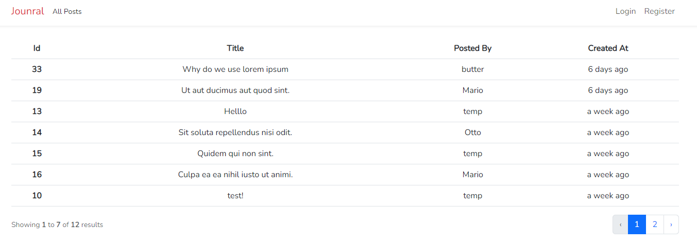

## Runtime and checks

Requires PHP 8.2 or newer and Node.js 22. Install with `composer install` and `npm ci`, then run `npm run build` and `php vendor/bin/phpunit`. Tests use isolated SQLite and do not require production credentials.

# Journal-Laravel

Building a full stack blog using Laravel

### App Features

-   Authentication
-   File upload
-   CRUD opertaion on making a post
-   Comments on posts
-   Validation
-   Pagination

### Snapshot

